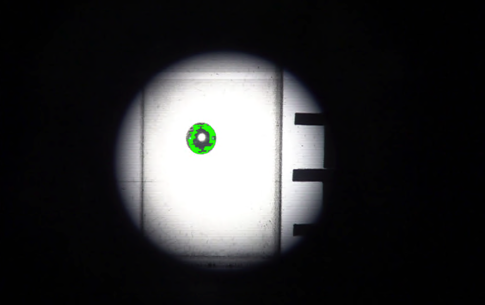

#### m1\contourdetection.ipynb
カールスト2に入ってるプログラム

--------------------------------------------------------

提供されたソースコードは、動画からフレームを抽出し、それぞれのフレームに対して画像処理を行い、特定の輪郭（この場合は面積でソートされた輪郭の中で3番目に大きいもの）の特徴を抽出する処理を行っています。
以下に、このコードセクションの機能と目的を詳細に言語化します。

### ソースコードの解説
#### キャリブレーション
    マウスクリックによる座標取得:

    グレースケール画像を表示し、マウスクリックイベントを使用して座標（x, y）を取得します。
    クリックされた位置に円を描き、座標を画像上にテキストで表示します。
    距離計算:

    取得した座標リストを用いて、連続する座標間のユークリッド距離を計算します。
    平均値の計算と表示:

    計算された距離の平均値を求め、ピクセルあたりの実際の距離（mm）を表示します。
    結果のCSVファイルへの保存:

    計算されたピクセル数/mmの値をCSVファイルに保存します。
    特定の技術やアルゴリズム
    画像処理におけるユーザーインタラクション（マウスクリック）を使用した座標取得。
    ユークリッド距離の計算を用いたキャリブレーション。
    プログラムの入出力
    入力：グレースケール化された画像ファイル。
    出力：ユーザーが選択した座標間の平均距離（ピクセル数/mm）、CSVファイルに保存されたキャリブレーションデータ。
    
#### 主な違い
    入力画像の選択:

    B4では複数のフレームが使用され、M1では単一の静止画像が使用されます。
    座標取得のプロセス:

    両方の方法でマウスクリックによる座標取得が行われますが、B4では動画フレームを使用し、M1では静止画像を使用しています。
    キャリブレーション計算:

    B4では、選択された座標間の距離の平均値をさらに10で割ってピクセル/mmの値を算出しています。
    M1では、平均距離そのものがピクセル/mmの値として直接使用されています。
    これらの違いは、キャリブレーションの精度や利便性に影響を与える可能性があり、プログラムの目的や使用環境に応じて適切な方法を選択する必要があります。特に、形状が異なる気泡の測定においては、より正確で信頼性の高いキャリブレーション方法の選択が重要です。

#### 1. ビデオデータの読み込みと基本情報の取得
    指定されたビデオファイルからフレームを読み込みます。
    ビデオの幅、高さ、総フレーム数、フレームレート（fps）を取得し、ビデオの長さを計算します。
#### 2. フレームの処理
    1. 各フレームの画像ファイルへの保存
    ビデオから読み込まれた各フレームは、指定されたパスにBMP形式の画像ファイルとして保存されます。
    このステップでは、cv2.imwrite 関数を使用して、フレームをディスクに書き出しています。
    保存されたフレームは後続の画像処理のための入力として使用されます。
    2. グレースケール変換
    各フレームはグレースケール（白黒）画像に変換されます。
    グレースケール変換は、cv2.cvtColor 関数を使用して行われ、カラー画像を単一の輝度チャネルに変換します。
    この変換により、画像の色情報が除外され、輪郭検出に必要な明暗情報のみが抽出されます。
    3. 平滑化処理
    グレースケール画像に対して平滑化（ノイズ低減）処理が施されます。
    平滑化は、cv2.bilateralFilter 関数を用いて行われ、画像のエッジを保持しながらノイズを低減します。
    この処理により、画像の品質が向上し、輪郭検出が容易になります。
    4. 2値化処理
    平滑化されたグレースケール画像をさらに2値化（黒または白のみの画像）します。
    2値化は、cv2.threshold 関数を使用し、cv2.THRESH_BINARY_INV と cv2.THRESH_OTSU のフラグを用いて最適な閾値で行われます。
    この処理により、画像内の主要な特徴（ここでは気泡の輪郭）がよりはっきりと際立ちます。
#### 3. 輪郭の検出と描画
    1. 輪郭の検出手順
    2値化された画像から輪郭を検出するために、cv2.findContours 関数が使用されます。
    この関数は、画像内のすべての輪郭を検出し、それらの輪郭を表すポイントのリストを返します。
    cv2.RETR_TREE モードは、輪郭の階層構造を考慮してすべての輪郭を抽出します。
    cv2.CHAIN_APPROX_NONE アルゴリズムは、輪郭を形成するすべてのポイントを保持します。
    2. 輪郭の選択と優先順位付け
    検出された輪郭は、cv2.contourArea 関数を用いて、それぞれの面積に基づいてソートされます。
    最も面積が大きい輪郭から順に並べ替えられ、特定の輪郭（このケースでは面積が3番目に大きい輪郭）が選択されます。
    輪郭の描画
    1. 描画手順
    選択された輪郭は元の画像に描画されます。
    cv2.drawContours 関数を使用して、選択された輪郭を画像に緑色の線で描画します。
    描画された画像は、後の分析や視覚的な確認のために保存されます。
    2. 重要性
    輪郭の描画は、気泡の形状やサイズを視覚的に理解するのに役立ちます。
    このプロセスにより、気泡の動態やその他の特性をより明確に分析することが可能になります。

#### 4. 面積と重心の計算
    選択された輪郭の面積と重心（図心）を計算します。
    計算された重心の位置に円を描き、画像に保存します。
    重心の座標と面積のデータをリストに追加し、後の分析のために保存します。
#### 5. プログラムのループと終了条件
    while ループを使用してビデオのすべてのフレームを処理します。
    ビデオの終了時点でループから抜け出し、処理を終了します。
    観察と考慮点
    このプログラムは、ビデオデータからのフレームごとの輪郭検出と分析を自動化しています。
    平滑化と2値化処理は、画像から重要な特徴を際立たせ、輪郭検出を容易にします。
    重心の計算は、気泡の動きを追跡するための基礎データを提供します。

### M1プログラムの改善点と新機能
    輪郭の詳細な分析: 輪郭の面積に基づいて輪郭をソートし、特定の輪郭（このケースでは3番目に大きい輪郭）に焦点を当てることで、より詳細な画像解析を行っています。これは、特定の形状やサイズの気泡に注目する際に有用です。
    画像処理の精度向上: 平滑化処理を施すことで、ノイズの影響を抑え、輪郭検出の精度を高めています。
    データ管理の改善: 処理された各種画像を別々のディレクトリに保存することで、データの整理と管理が容易になっています。

### B4プログラムとの比較
    輪郭検出の精度と焦点: B4プログラムでは、気泡の輪郭検出においてシンプルなアプローチが取られていた可能性がありますが、M1プログラムでは、輪郭の面積に基づくソートや特定の輪郭への焦点化を通じて、より複雑な解析が可能になっています。
    画像処理の詳細化: 平滑化処理の導入により、画像処理の精度が向上しています。
    整理されたデータ管理: データを異なるディレクトリに分けて管理することで、B4プログラムよりも整理されたデータ管理が行われています。

### データ解析における問題点の検証

    
    欠落データ: 輪郭検出が行えないフレームがあると、そのフレームのデータが解析から欠落します。これにより、気泡の動きの時間的な連続性が失われ、速度や加速度などの計算に影響を与える可能性があります。

    精度の低下: 不完全な輪郭情報は、面積や位置などの計算精度を低下させるため、気泡の挙動に関する正確な解析が困難になります。

    バイアス: 特定のタイプの画像でのみ輪郭が検出される場合、データにバイアスが生じる可能性があり、統計的な解析結果に歪みが生じるかもしれません。

### グラフの可視化
#### 1. グラフ設定とレイアウト
    matplotlib ライブラリの subplots 関数を使用して、2x2のグリッドに4つのグラフを配置します。
    figsize パラメータにより、グラフ全体のサイズを設定します。
    subplots_adjust 関数でグラフ間の余白を調整します。
#### 2. データリスト
    area_list, number_list, cx_list, cy_list といったリストには、それぞれ面積、フレーム番号、輪郭のx座標、輪郭のy座標が格納されています。
#### 距離の計算
    1. 距離計算のプロセス
    プログラムでは、cx_list と cy_list に保存された連続するフレームの輪郭の中心（重心）座標を用いて距離を計算します。
    計算は、各フレームの重心座標間のユークリッド距離を求めることで行われます。
    ユークリッド距離の計算式は dis = sqrt((x2 - x1)^2 + (y2 - y1)^2) です。ここで、(x1, y1) と (x2, y2) は連続するフレームの重心座標です。
    この計算を全フレームに対して繰り返し、各フレーム間の移動距離を求めます。
    2. 距離リストの作成
    各フレーム間の距離は dis_list というリストに保存されます。
    このリストは、気泡の各フレーム間の動き（移動距離）を表しています。
    距離のプロット
    1. プロットの設定
    matplotlib の plot 関数を使用して、距離データ（dis_list）をグラフにプロットします。
    x軸はフレーム番号を表し、y軸は各フレーム間の移動距離を表します。
    2. グラフのカスタマイズ
    グラフにはタイトル「moving distance」と軸ラベル（x軸:「frame」、y軸:「distance[pixel]」）が設定されます。
    このグラフは、気泡の動きの大きさとパターンを視覚的に理解するのに役立ちます。
    3. グラフの保存
    最終的に作成されたグラフはJPEGファイルとして保存され、後で参照や分析に使用できます。
#### 4. 各グラフの作成
    4つのグラフにそれぞれ異なるデータセットをプロットします。
    第1グラフ: 各フレーム間での移動距離 (dis_list)。
    第2グラフ: 輪郭のx座標とy座標 (cx_list, cy_list)。
    第3グラフ: フレーム番号と輪郭のx座標 (number_list, cx_list)。
    第4グラフ: フレーム番号と輪郭のy座標 (number_list, cy_list)。
#### 5. グラフのタイトルとラベル
    各グラフにタイトルと軸ラベルを設定します。
#### 6. グラフの保存
    最終的に作成されたグラフをJPEGファイルとして保存します。

